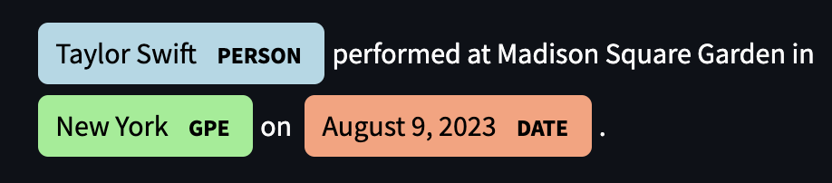

## 🧠 Custom Named Entity Recognition (NER) App

Welcome to the **Custom NER App**, a web-based tool built with **spaCy** and **Streamlit** that lets users explore Named Entity Recognition (NER) with their own text and custom rules.

This app is designed for interactive NLP experimentation — you can define your own entity labels (like CELEBRITY, BRAND, or EVENT) and see them instantly highlighted alongside default spaCy NER output.

---

## 🎯 App Overview

**Key Features:**

- 📝 Paste or upload .txt files
- 🏷️ Add your own NER rules using EntityRuler
- 🔍 Analyze the full text for built-in and custom entities
- 🎨 Clean, dark-mode layout with styled output and emojis

---

## 📷 Screenshot

Here’s an example of the app in action, showing spaCy’s default entity recognition:

## 📷 Screenshot

> “Taylor Swift performed at **Madison Square Garden** (ORG) in **New York** (GPE) on **August 9, 2023** (DATE).”

> Example sentence:  
> _“Taylor Swift performed at **Madison Square Garden** (ORG) in **New York** (GPE) on **August 9, 2023** (DATE).”_

This shows spaCy’s default detection of people, locations, organizations, and dates — no custom patterns required.

---

## 🛠 How to Use the App

### 🔹 Step 1: Enter or Upload Text

Paste a block of text into the input box  
**OR**  
Upload a .txt file.

Example: Taylor Swift performed at Madison Square Garden in New York on August 9, 2023.

---

### 🔹 Step 2: (Optional) Add Custom Entity Patterns

You can add your own labels and match patterns.  
Example:

- Label: EVENT  
- Pattern: Eras Tour

Click ➕ **Add Pattern**

> You can also add multiple patterns separated by commas.

---

### 🔹 Step 3: Click “Analyze Text”

Click 🚀 **Analyze Text** to see the results.  
Entities will be visually highlighted and labeled, including your custom ones.

---

---

## 🚀 App Features

The Custom NER App is designed to help users explore and apply Named Entity Recognition (NER) in an intuitive and interactive way. Here's what you can do:

### 📄 1. Upload or Enter Text

- Paste your own text directly into the input box  
- Or upload a .txt file to analyze larger documents  
- Example input: Taylor Swift performed at Madison Square Garden in New York on August 9, 2023.

---

### 🏷️ 2. Add Custom Entity Patterns

- Define your own entity labels (e.g., FOOD, BRAND, EVENT)
- Add one or more patterns (comma-separated) that you want to tag
- Example:

- **Label**: EVENT  
- **Pattern**: Eras Tour

- **Label**: ORG  
- **Pattern**: Spotify, Chick-fil-A

> Custom patterns are matched case-insensitively across tokens, and override spaCy’s default NER when added.

---

### 🎨 3. Visualize Entity Highlights

- Click the **"Analyze Text"** button
- View all detected entities — both default and custom — in color-coded highlights
- Each label has a distinct color (e.g., PERSON = blue, ORG = gold, GPE = green)

> The visualization is powered by spaCy’s [DisplaCy](https://spacy.io/usage/visualizers) engine and rendered directly inside the app.

---

---

## 🌐 How to Deploy This App to Streamlit Cloud

You can run this app live on the web using [Streamlit Cloud](https://streamlit.io/cloud). Here’s how to deploy it yourself:

### 🚀 Step-by-Step Deployment Instructions

1. **Push your app to GitHub**

Make sure your app folder (this project) is on GitHub and includes:
- app.py
- requirements.txt
- .streamlit/config.toml (for dark theme)
- Any assets (like images or screenshots)

If you haven't yet:

bash
git add .
git commit -m "Final app version ready for deployment"
git push origin main

Log in to Streamlit Cloud

Use your GitHub account to sign in

Click “New app”

Configure your deployment

Fill out the form:

Repository: yourusername/DAMONTE-Python-Portfolio

Branch: main

App file path: NERStreamlitApp/app.py

Click “Deploy” 🚀

Wait for it to build

Streamlit will:

Clone your repo

Install everything from requirements.txt

Launch the app automatically

Get your live URL

After it deploys, you’ll get a public link like:
👉 [Click here to try the app live](https://damonte-python-portfolio-r2fnqpbevnnb7okbc6hwdf.streamlit.app/)

---

**🧠 Powered By**

| Tool          | Description                                 |
|---------------|---------------------------------------------|
| `spaCy`       | NLP model for Named Entity Recognition      |
| `EntityRuler` | Rule-based pattern matching for custom NER  |
| `Streamlit`   | Web interface and interactive dashboard     |
| `DisplaCy`    | Visualization for named entities            |

---

**📚 References**

- 🔗 [spaCy Documentation](https://spacy.io/usage)  
- 🔧 [spaCy EntityRuler](https://spacy.io/usage/rule-based-matching#entityruler)  
- 🎨 [DisplaCy Visualizer](https://spacy.io/usage/visualizers)  
- 🖥️ [Streamlit Documentation](https://docs.streamlit.io)  
- 🧠 [Streamlit + spaCy
