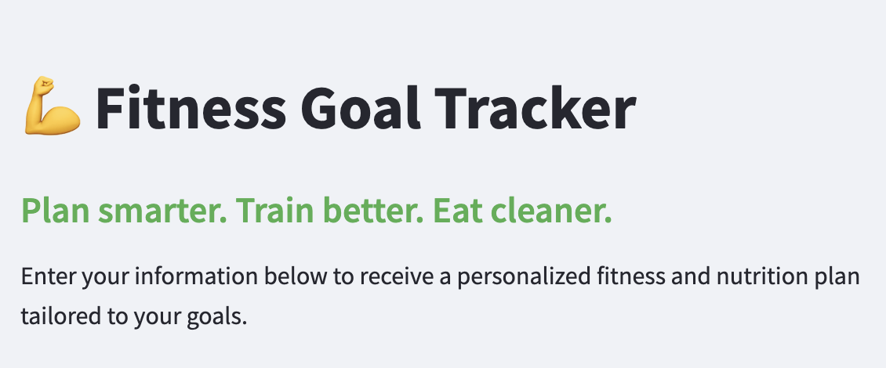
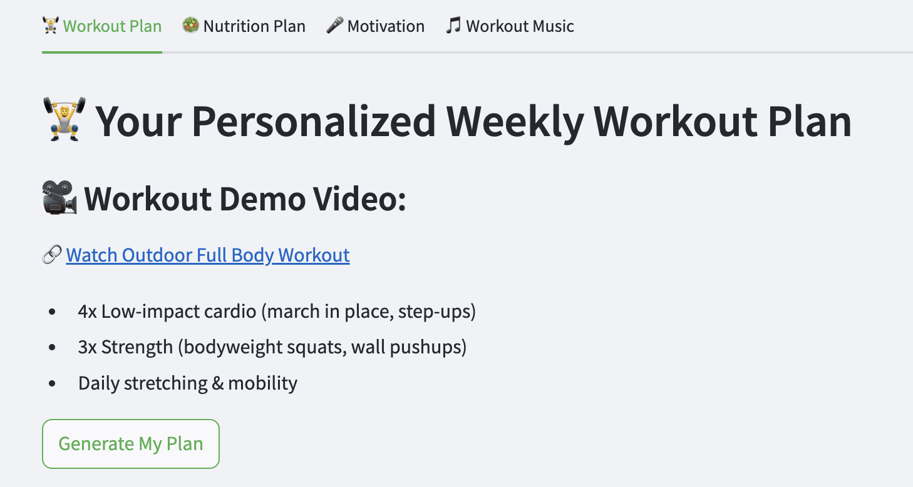
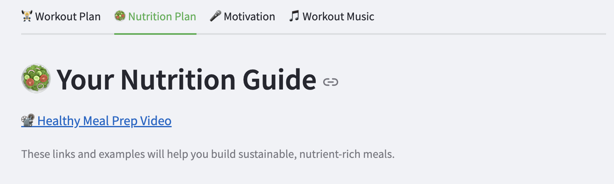
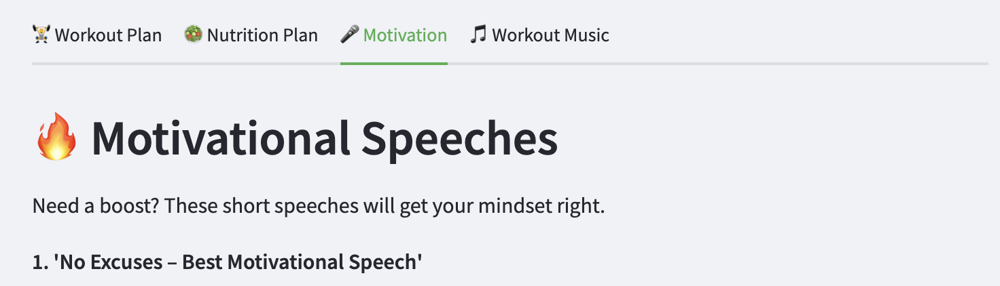

# 💪 Fitness Goal Tracker

## 📌 Project Overview
This Streamlit app creates a customized fitness and nutrition plan based on user inputs including weight, height, age, activity level, and fitness goals. It was built to help users take control of their wellness journey by providing real-time feedback, workout guidance, meal suggestions, motivational speeches, and music playlists — all in one seamless, interactive tool.

Whether you're trying to lose weight, gain muscle, or maintain a healthy lifestyle, this app delivers tailored recommendations, sample workouts, healthy recipes, inspiring videos, and even music to keep you going.

---

## 🛠️ Setup & Run Instructions

### 🧱 Local Installation

1. Clone the repository:
   ```bash
   git clone https://github.com/evadamonte/DAMONTE-Python-Portfolio.git
   cd DAMONTE-Python-Portfolio/StreamlitAppFinal
   ```

2. Install dependencies:
   ```bash
   pip install -r requirements.txt
   ```

3. Run the app:
   ```bash
   streamlit run app.py
   ```

> ⚠️ Tip: If the image doesn't load, make sure `my_photo.jpg` is in the same folder as `app.py`.

---

### ☁️ Deployed Version

**Live App URL:**  
[🔗 Click to view the deployed Streamlit app](https://evadamonte-ofqmom4cvvps7fdhkyfvgn.streamlit.app/)

---

## ✨ App Features (Expanded)

- **📋 Smart User Input Forms**  
  Users enter personalized information including:
  - Current and goal weight (lbs)
  - Height in feet and inches
  - Age and activity level
  - Primary fitness goal (Lose weight, Gain muscle, Maintain)
  - Preferred workout location (At Home, Outdoor, Gym)  
  The app uses this data to calculate BMI, estimate daily calorie needs, and dynamically generate tailored fitness and nutrition plans.

- **📊 Real-Time Health Metrics**  
  - Body Mass Index (BMI) is calculated and interpreted in real time.
  - The app gives feedback based on BMI category (Underweight, Healthy, Overweight, Obese).
  - BMR (Basal Metabolic Rate) and target daily calorie intake are computed using the Mifflin-St Jeor equation and activity multipliers.

- **🏋️ Adaptive Workout Plan Generator**  
  The workout plan updates based on:
  - BMI status (underweight, overweight, etc.)
  - User goal (fat loss, muscle gain, maintenance)
  - Workout location  
  It offers realistic weekly schedules and suggestions such as HIIT, low-impact cardio, strength training, or yoga. Plans are broken down by day type and include suggestions for no-equipment options.

- **🥗 Nutrition Guidance With Resources**  
  The nutrition tab includes:
  - A curated video on healthy meal prepping
  - Detailed guidance on protein, carbs, fats, and vegetable intake
  - External recipe links to support users in meal planning  
  Users get linked to credible sources like BBC Good Food, Mayo Clinic, and Oh She Glows for meals like power bowls, smoothies, and omelets.

- **🎤 Motivational Video Hub**  
  The app embeds high-energy motivational speeches from YouTube directly into the interface, allowing users to watch:
  - “No Excuses – Best Motivational Speech”
  - “YOU vs YOU – Motivational Video for Success”
  - “STAY HARD – David Goggins Motivation”

- **🎵 Interactive Music Playlists**  
  Spotify playlists are embedded and switch based on workout type:
  - Yoga 🧘: Calm and meditative tracks
  - Jogging 🏃: Rhythmic and upbeat tempo
  - Weight Lifting 🏋️: Intense, high-energy tracks

- **📥 Downloadable Fitness Plan**  
  After generating a custom fitness plan, users can download a `.txt` file containing:
  - BMI and calorie feedback
  - Weekly workout breakdown
  - Key nutrition goals and food group summaries  
  This gives users a portable and printable version of their wellness plan.

---

## 🔗 References & Resources

- [Streamlit Documentation](https://docs.streamlit.io/)
- [Pillow (PIL) Image Library](https://pillow.readthedocs.io/)
- [BBC Good Food – High Protein Recipes](https://www.bbcgoodfood.com/recipes/collection/high-protein-recipes)
- [Mayo Clinic – Healthy Carb Recipes](https://www.mayoclinic.org/healthy-lifestyle/recipes/healthy-carb-recipes/rcs-20077160)
- [South Beach – Healthy Fats](https://palm.southbeachdiet.com/healthy-fat-servings/)
- [Love and Lemons – Vegetable Side Dishes](https://www.loveandlemons.com/vegetable-side-dishes/)
- [JoyFoodSunshine – Smoothie + Omelet Recipes](https://joyfoodsunshine.com/)
- [Oh She Glows – Power Bowl Meal Prep](https://ohsheglows.com/meal-prep-week-long-power-bowls/)
- [Motivation Videos:](https://www.youtube.com/watch?v=BHY0FxzoKZE), [YOU vs YOU](https://www.youtube.com/watch?v=H5ExSyGTgt4), [David Goggins](https://www.youtube.com/watch?v=QTB1YiWxxKU)
- [Spotify Playlists](https://open.spotify.com/)

---

## 📷 Visual Examples

> 💡 Save these images in a folder called `screenshots/` inside your `StreamlitAppFinal/` directory and push them to GitHub.

### Home Screen


### Workout Plan Tab


### Nutrition Tab with Recipe Links


### Motivation & Music Tabs


---

## 👨‍💻 Built By

**Eva Diana Damonte**  
The University of Notre Dame | Computing 2 Final project  
Athlete-turned-developer focused on creating real-world solutions that motivate, educate, and empower users to take control of their fitness journey.
